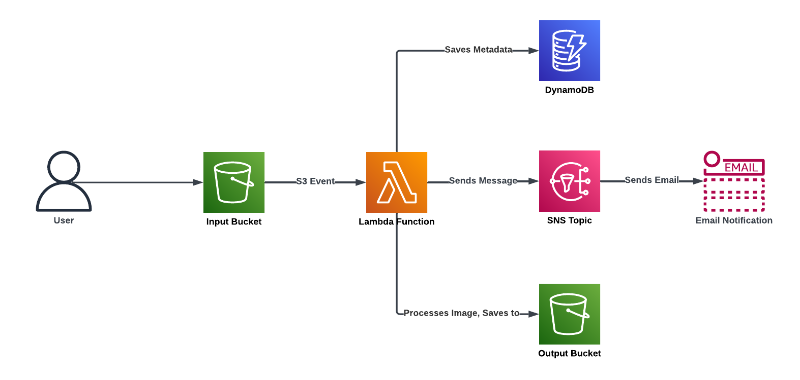

# Serverless Image Processing Pipeline

## Project Overview

This project implements a scalable, serverless architecture for automated image processing using AWS services. It automatically resizes images uploaded to an S3 bucket, stores metadata in DynamoDB, and sends notifications via SNS upon successful processing.

### Purpose

The primary goal of this project is to demonstrate the implementation of a serverless architecture for efficient, event-driven workflows. It showcases how to leverage various AWS services to create a robust, scalable image processing pipeline.

## Technologies Used

- AWS Lambda: Serverless compute service
- Amazon S3: Object storage for original and processed images
- Amazon DynamoDB: NoSQL database for storing image metadata
- Amazon SNS: Notification service for sending email alerts
- Python 3.9: Primary programming language
- Pillow (Python Imaging Library): Image processing library

## Architecture



1. User uploads an image to the input S3 bucket
2. S3 event triggers the Lambda function
3. Lambda function processes the image (resizes it) using Pillow
4. Processed image is saved to the output S3 bucket (or folder)
5. Image metadata is saved to DynamoDB
6. SNS notification is sent to the user

## Setup and Deployment

### Prerequistes

- AWS CLI installed and configured
- Python 3.9 installed
- Serverless Framework installed (optional, for easier deployment)

### Deployment Steps

1. Clone the repository:

```
git clone https://github.com/aclittle/serverless-image-processor.git
cd serverless-image-processor
```

2. Create S3 buckets:

```
aws s3 mb s3://your-input-bucket-name
aws s3 mb s3://your-output-bucket-name
```

3. Create a DynamoDB table:

```
aws dynamodb create-table --table-name ImageMetadata --attribute-definitions AttributeName=ImageId,AttributeType=S --key-schema AttributeName=ImageId,KeyType=HASH --provisioned-throughput ReadCapacityUnits=5,WriteCapacityUnits=5
```

4. Create an SNS topic:

```
aws sns create-topic --name ImageProcessingNotifications
```

5. Deploy the Lambda function:

- If using Serverless Framework:

```
serverless deploy
```

- If deploying manually:
  - Create a ZIP file containing `image-processor-lambda.py` and any dependencies
  - Create a Lambda function using the AWS console or CLI, uploading the ZIP file
  - Set the function's handler to `image-processor-lambda.lambda_handler`
  - Set the following environment variables:
    - `DYNAMODB_TABLE`: The name of your DynamoDB table
    - `SNS_TOPIC_ARN`: The ARN of your SNS topic

6. Configure S3 event trigger:

- In the S3 console, set up an event notification on your input bucket to trigger the Lambda function on object creation

7. Add the Pillow layer to your Lambda function:

- In the Lambda console, add the following ARN as a layer:

```
arn:aws:lambda:us-east-1:770693421928:layer:Klayers-p39-pillow:1
```

## Usage

1. Upload an image to your input S3 bucket
2. The image will be automatically processed and resized
3. Check the output S3 bucket for the processed image
4. Verify that the metadata has been added to the DynamoDB table
5. You should receive an SNS notification about the processed image

## Challenges Face and Solutions

### 1. Recursive Triggering

**Issue:** The Lambda function was triggering itself by uploading processed images back to the same bucket.

**Solutions:** Implemented a two-bucket system, where the Lambda function processes images from the source bucket and uploads them to a separate destination bucket.

## 2. Pillow Library in Lambda

**Issue:** Difficulty in including the Pillow library in the Lambda environment.

**Solutions:** Initially attempted to create a custom Lambda layer with Pillow installed, which proved challenging. Ultimately, used a pre-built Pillow layer available on AWS:

```
arn:aws:lambda:us-east-1:770693421928:layer:Klayers-p39-pillow:1
```

This layer was added to the Lambda function, providing the necessary Pillow library without the need for custom packaging.

## Future Enhancements

1. Support for multiple image processing operations (e.g., filters, cropping)
2. Web interface for easy image uploading and viewing
3. User authentication and user-specific processing rules
4. Improved error handling and retry mechanisms

## Contributing

Contributions are welcome! Please feel free to submit a Pull Request.

## License

This project is licensed under the MIT License - see the LICENSE file for details.
